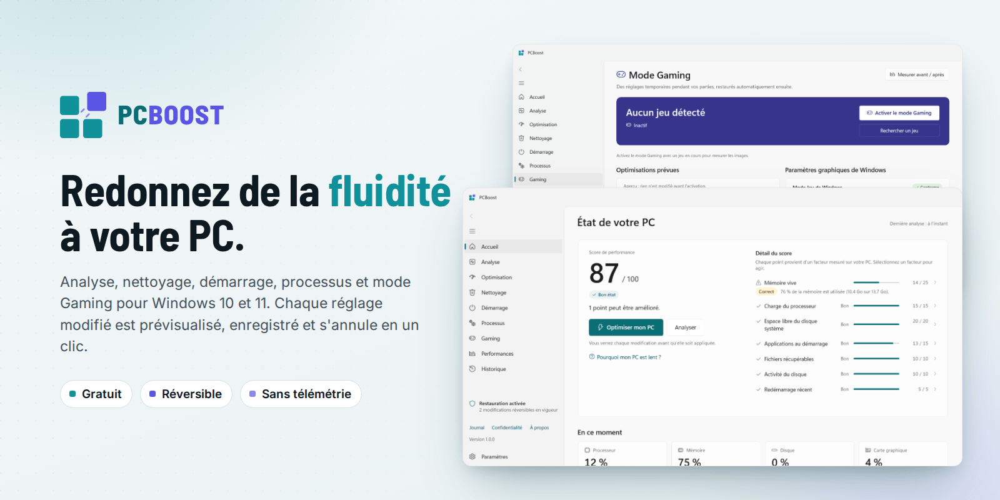
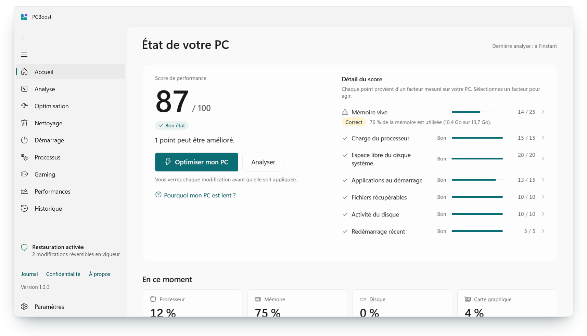
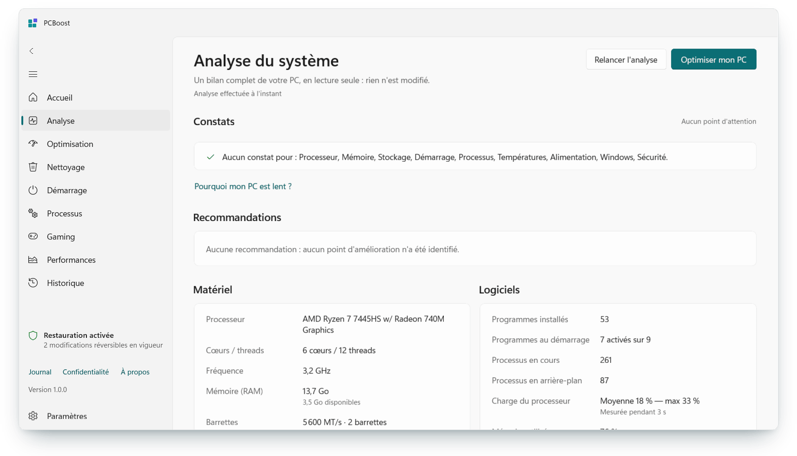
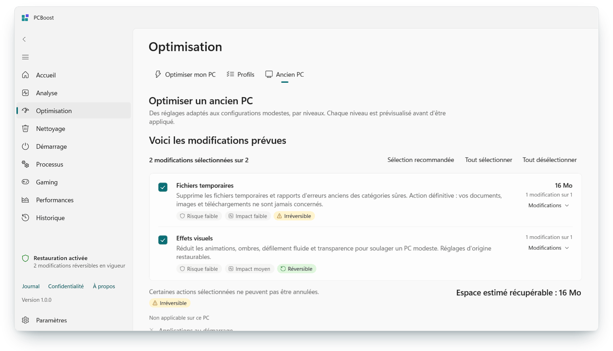
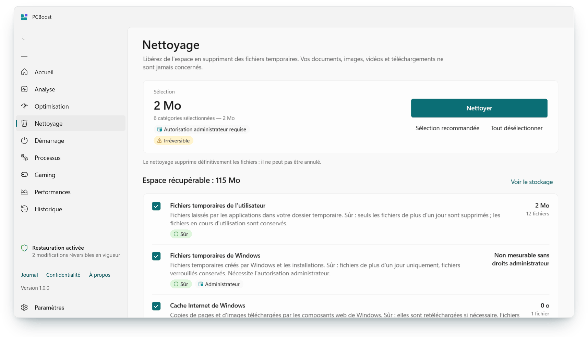
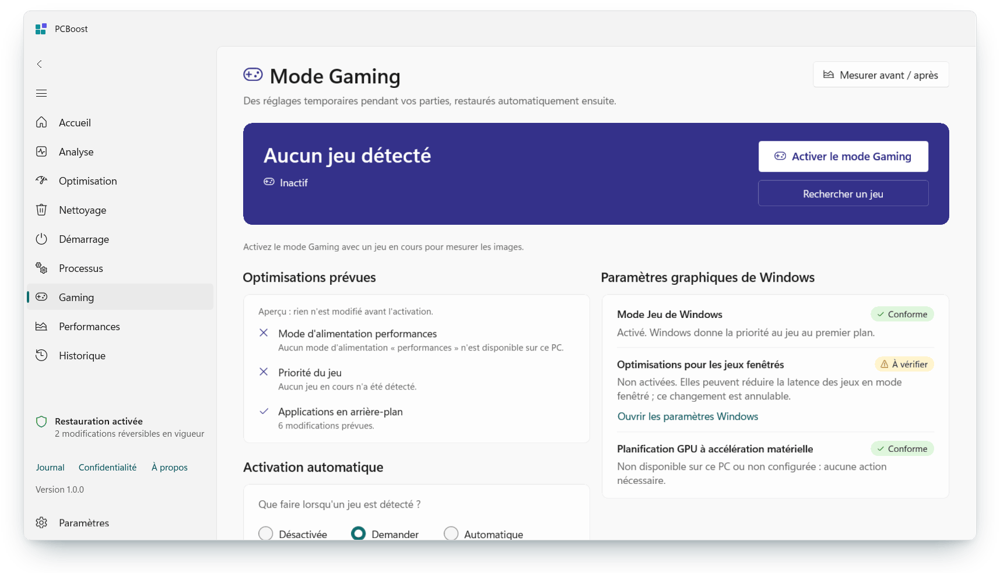
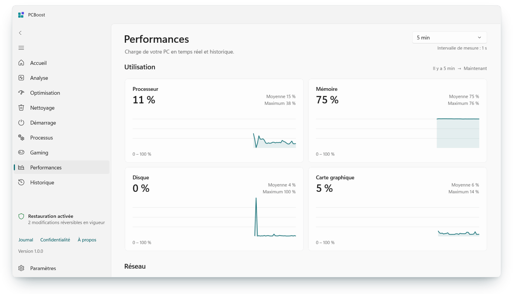
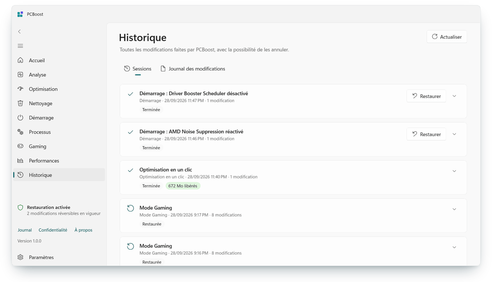
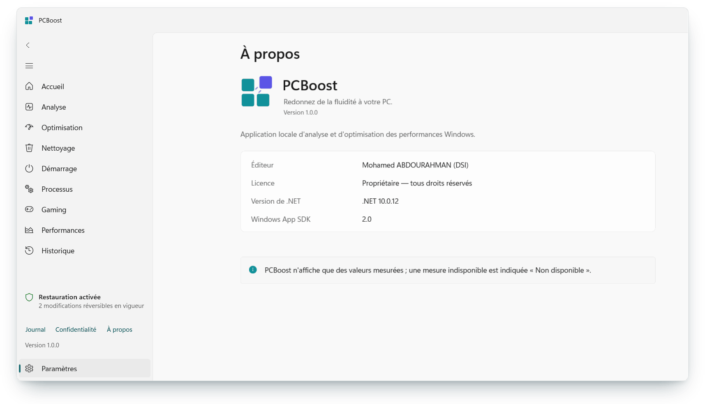
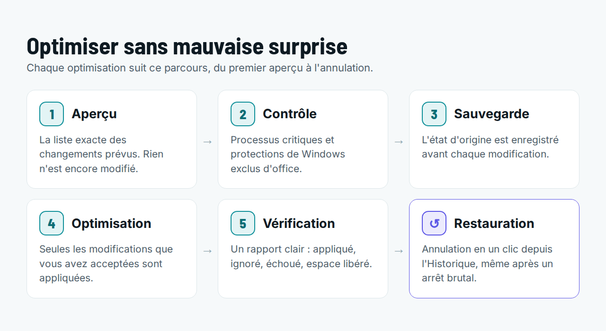

<p align="center">
  <picture>
    <source media="(prefers-color-scheme: dark)" srcset="docs/images/banner-dark.png">
    
  </picture>
</p>

<p align="center">
  <a href="https://github.com/NETFIX253/PCBoost/releases/download/v1.0.0/PCBoost-1.0.0-x64.msi"></a>
  &nbsp;
  <a href="https://github.com/NETFIX253/PCBoost/releases/download/v1.0.0/PCBoost-1.0.0-x64-portable.zip"></a>
</p>

<p align="center">
  <a href="https://github.com/NETFIX253/PCBoost/releases/latest"></a>
  <a href="https://github.com/NETFIX253/PCBoost/releases/latest"></a>
  
  
  <a href="LICENSE"></a>
</p>

<p align="center">
  <b>PCBoost</b> aide les PC anciens, modestes ou surchargés de processus à retrouver de la réactivité&nbsp;:<br>
  sans promesse invérifiable, sans « tweak » risqué, et avec un retour arrière pour chaque modification.
</p>

<p align="center">
  <a href="#-télécharger">Télécharger</a> ·
  <a href="#-aperçu">Aperçu</a> ·
  <a href="#-fonctionnalités">Fonctionnalités</a> ·
  <a href="#-ce-que-pcboost-ne-fait-jamais">Sécurité</a> ·
  <a href="#-crédits">Crédits</a>
</p>

---

## 📥 Télécharger

| | Fichier | Idéal pour |
|---|---|---|
| **Installateur** (recommandé) | [`PCBoost-1.0.0-x64.msi`](https://github.com/NETFIX253/PCBoost/releases/download/v1.0.0/PCBoost-1.0.0-x64.msi) · 66 Mo | Une installation classique : dossier *Program Files*, raccourci dans le menu Démarrer, raccourci Bureau et lancement avec Windows en option, désinstallation depuis les *Paramètres*. |
| **Version portable** | [`PCBoost-1.0.0-x64-portable.zip`](https://github.com/NETFIX253/PCBoost/releases/download/v1.0.0/PCBoost-1.0.0-x64-portable.zip) · 83 Mo | Aucune installation : décompressez le dossier puis lancez `PCBoost.exe`. Pratique sur une clé USB ou un poste partagé. |

Toutes les versions et notes de publication : **[page des Releases](https://github.com/NETFIX253/PCBoost/releases/latest)**.

**Configuration requise** : Windows 10 (version 1809 ou ultérieure) ou Windows 11, 64 bits. Aucun autre logiciel à installer : tout est inclus.

> [!NOTE]
> **Premier lancement et SmartScreen.** Les fichiers ne sont pas encore signés numériquement. Windows peut donc afficher « Windows a protégé votre ordinateur » : cliquez sur **Informations complémentaires**, puis **Exécuter quand même**.
> Pour vérifier que le fichier téléchargé est intact, comparez son empreinte avec [`SHA256SUMS.txt`](https://github.com/NETFIX253/PCBoost/releases/download/v1.0.0/SHA256SUMS.txt) :
> ```powershell
> Get-FileHash .\PCBoost-1.0.0-x64.msi -Algorithm SHA256
> ```

## ✨ Pourquoi PCBoost ?

<table>
  <tr>
    <td width="20%" valign="top"><h3>📏 Honnête</h3>Chaque chiffre est mesuré sur votre PC, ou marqué « Non disponible ». Aucun gain n'est annoncé sans mesure avant / après.</td>
    <td width="20%" valign="top"><h3>👁️ Prévisualisé</h3>Rien n'est modifié sans que vous ayez vu la liste exacte des changements.</td>
    <td width="20%" valign="top"><h3>↩️ Réversible</h3>Chaque réglage modifié est enregistré <i>avant</i> d'être appliqué et s'annule en un clic, même après un arrêt brutal.</td>
    <td width="20%" valign="top"><h3>🛡️ Sûr</h3>Defender, Pare-feu, Windows Update, SmartScreen, BitLocker et les processus essentiels ne sont jamais touchés.</td>
    <td width="20%" valign="top"><h3>🔒 Local</h3>Aucune télémétrie. Aucune donnée ne quitte le PC.</td>
  </tr>
</table>

## 🖼️ Aperçu

<table>
  <tr>
    <td width="50%" valign="top">
      <picture>
        <source media="(prefers-color-scheme: dark)" srcset="docs/images/screen-home-dark.png">
        
      </picture>
      <p align="center"><b>Accueil</b> — un score sur 100 explicable : chaque point vient d'un facteur mesuré.</p>
    </td>
    <td width="50%" valign="top">
      <picture>
        <source media="(prefers-color-scheme: dark)" srcset="docs/images/screen-analysis-dark.png">
        
      </picture>
      <p align="center"><b>Analyse</b> — un bilan complet en lecture seule : rien n'est modifié.</p>
    </td>
  </tr>
  <tr>
    <td width="50%" valign="top">
      <picture>
        <source media="(prefers-color-scheme: dark)" srcset="docs/images/screen-oldpc-dark.png">
        
      </picture>
      <p align="center"><b>Ancien PC</b> — des réglages par niveaux, adaptés aux configurations modestes.</p>
    </td>
    <td width="50%" valign="top">
      <picture>
        <source media="(prefers-color-scheme: dark)" srcset="docs/images/screen-cleanup-dark.png">
        
      </picture>
      <p align="center"><b>Nettoyage</b> — catégories SÛR / PRUDENCE / AVANCÉ ; vos documents ne sont jamais concernés.</p>
    </td>
  </tr>
  <tr>
    <td width="50%" valign="top">
      <picture>
        <source media="(prefers-color-scheme: dark)" srcset="docs/images/screen-gaming-dark.png">
        
      </picture>
      <p align="center"><b>Mode Gaming</b> — des réglages temporaires, restaurés automatiquement à la fermeture du jeu.</p>
    </td>
    <td width="50%" valign="top">
      <picture>
        <source media="(prefers-color-scheme: dark)" srcset="docs/images/screen-performance-dark.png">
        
      </picture>
      <p align="center"><b>Performances</b> — processeur, mémoire, disque, GPU et réseau, de 30 s à 7 jours.</p>
    </td>
  </tr>
  <tr>
    <td width="50%" valign="top">
      <picture>
        <source media="(prefers-color-scheme: dark)" srcset="docs/images/screen-history-dark.png">
        
      </picture>
      <p align="center"><b>Historique</b> — chaque session et chaque modification peut être restaurée.</p>
    </td>
    <td width="50%" valign="top">
      <picture>
        <source media="(prefers-color-scheme: dark)" srcset="docs/images/screen-about-dark.png">
        
      </picture>
      <p align="center"><b>Thèmes clair et sombre</b>, français et anglais. Les captures suivent le thème de votre GitHub.</p>
    </td>
  </tr>
</table>

## 🧭 Comment ça marche

<p align="center">
  <picture>
    <source media="(prefers-color-scheme: dark)" srcset="docs/images/workflow-dark.png">
    
  </picture>
</p>

1. Au premier lancement, PCBoost analyse votre PC (en lecture seule).
2. L'accueil affiche un score sur 100 et ce qui peut être amélioré.
3. **Optimiser mon PC** montre d'abord la liste des modifications prévues ; rien n'est appliqué sans votre accord.
4. Tout se retrouve dans **Historique**, prêt à être annulé.

## 🧰 Fonctionnalités

| Domaine | Ce que fait PCBoost |
|---|---|
| Tableau de bord | Score de santé sur 100 **explicable** (chaque point vient d'un facteur mesuré), charge en temps réel, recommandations principales, actions rapides. |
| Analyse du système | Bilan en lecture seule : matériel, logiciels, constats par catégorie, profil matériel, conseils matériels factuels. |
| « Pourquoi mon PC est lent ? » | Facteurs observés, impact et niveau de confiance, en langage simple. |
| Optimisation en un clic | Aperçu → Préparation → Sauvegarde → Optimisation → Vérification → Rapport final. |
| Profils | Équilibré, Productivité, Gaming, Économie d'énergie, Personnalisé. |
| Assistant « Ancien PC » | Niveaux Essentiel / Standard / Avancé, chaque étape expliquée. |
| Nettoyage | Catégories SÛR / PRUDENCE / AVANCÉ (SÛR sélectionné par défaut), fichiers en cours d'utilisation conservés. |
| Démarrage | Activation / désactivation réversible, identique au Gestionnaire des tâches. |
| Processus | Liste en direct, niveau de confiance (signature), fermeture douce, **processus critiques protégés**. |
| Mode Gaming | Détection des jeux (Steam, Epic, Xbox, Battle.net, Riot, Ubisoft, EA, GOG, Windows, ajouts manuels), activation manuelle, sur demande ou automatique, restauration automatique à la fermeture du jeu. |
| FPS | FPS moyen, 1 % low, 0,1 % low et temps d'image via les événements de présentation Windows (ETW), **sans aucune injection** dans le jeu. |
| Mesure avant / après | Comparaison de deux mesures de même durée ; seuls les écarts réellement mesurés sont affichés. |
| Performances | Graphiques processeur, mémoire, disque, GPU, réseau, températures (30 s à 7 jours), surveillance légère et adaptative. |
| Stockage | Répartition de l'espace du disque système, dossiers les plus volumineux (lecture seule). |
| Historique | Sessions d'optimisation, restauration d'une session ou d'une seule modification, journal d'activité. |
| Mode Expert | États avant / après bruts, journal technique, erreurs techniques. |
| Confort | Zone de notification, notifications Windows, lancement avec Windows, thèmes Clair / Sombre / Système, français et anglais, accessibilité (clavier, lecteurs d'écran, contraste élevé). |

## 🚫 Ce que PCBoost ne fait jamais

- Désactiver Microsoft Defender, le Pare-feu, Windows Update, SmartScreen ou BitLocker.
- Supprimer un fichier système ou l'un de vos documents, images, vidéos ou téléchargements.
- Fermer les processus essentiels de Windows.
- Modifier le BIOS, overclocker le matériel ou injecter du code dans les jeux (aucun anti-triche touché).
- Annoncer un gain qu'il n'a pas mesuré.

Détails : [docs/SECURITY.md](docs/SECURITY.md) et [docs/OPTIMIZATIONS.md](docs/OPTIMIZATIONS.md).

## 🔐 Droits administrateur et données

PCBoost s'exécute en **utilisateur standard**. Windows demande une autorisation administrateur (UAC) uniquement pour une action précise : nettoyer un dossier système, modifier un programme lancé au démarrage pour tous les utilisateurs, ou mesurer les images par seconde d'un jeu.

Tout reste sur votre PC, dans `%LOCALAPPDATA%\PCBoost` (historique et journaux ; les journaux masquent le nom d'utilisateur et le nom du PC). Ce dossier est conservé à la désinstallation pour permettre une réinstallation sans perte ; supprimez-le pour tout effacer.

**Désinstaller** : *Paramètres Windows → Applications → Applications installées → PCBoost → Désinstaller* (version installée), ou supprimez simplement le dossier (version portable). Pensez à annuler auparavant, depuis **Historique**, les modifications que vous ne souhaitez pas conserver.

## 🛠️ Pour les développeurs

<details>
<summary><b>Compiler, tester, publier</b></summary>

<br>

Sous Windows, avec le SDK .NET 10 (détails dans [BUILD.md](BUILD.md)) :

```powershell
powershell -ExecutionPolicy Bypass -File build\build.ps1                     # compilation + tests
powershell -ExecutionPolicy Bypass -File build\build.ps1 -Publish -Installer # + version portable + MSI dans dist\
```

La version 1.0.0 compile sans erreur ni avertissement et passe plus de 1 300 tests automatisés (xUnit).

</details>

<details>
<summary><b>Documentation technique</b></summary>

<br>

| Document | Contenu |
|---|---|
| [BUILD.md](BUILD.md) | Prérequis, commandes, tests, publication, installateur. |
| [docs/ARCHITECTURE.md](docs/ARCHITECTURE.md) | Couches, projets, flux (analyse, optimisation, restauration, élévation, Gaming), persistance, localisation. |
| [docs/SECURITY.md](docs/SECURITY.md) | Règles de sécurité, cibles interdites, processus protégés, modèle d'élévation, confidentialité. |
| [docs/OPTIMIZATIONS.md](docs/OPTIMIZATIONS.md) | Chaque optimisation, son mécanisme d'annulation, le nettoyage, le démarrage, ce qui n'est pas fait. |
| [docs/GAMING.md](docs/GAMING.md) | Détection des jeux, mode Gaming, mesure des FPS par ETW, benchmark. |
| [docs/SCORING.md](docs/SCORING.md) | Score de santé, constats, profil matériel, recommandations. |
| [docs/RELEASE_CHECKLIST.md](docs/RELEASE_CHECKLIST.md) | Vérifications avant publication. |
| [DESIGN.md](DESIGN.md) | Système visuel (Fluent), couleurs, typographie, logo. |
| [CHANGELOG.md](CHANGELOG.md) | Historique des versions. |
| [THIRD-PARTY-NOTICES.md](THIRD-PARTY-NOTICES.md) | Composants tiers et licences. |

</details>

<details>
<summary><b>Structure du dépôt</b></summary>

<br>

```
build/                  Branding.props, build.ps1, outils (i18n, images de marque, boucle de dev)
src/
  PCBoost.Core          Contrats, modèles, règles de sécurité (aucune dépendance Windows)
  PCBoost.System        Accès Windows : Win32, WMI, registre, processus, ETW
  PCBoost.Elevator      Assistant administrateur à liste blanche fermée (UAC ponctuel)
  PCBoost.Diagnostics   Analyse, score, constats, surveillance, historique des performances
  PCBoost.Optimization  Optimisations, nettoyage, démarrage, restauration, récupération
  PCBoost.Gaming        Détection des jeux, mode Gaming, FPS, benchmark
  PCBoost.Persistence   SQLite (migrations, dépôts)
  PCBoost.Infrastructure Journalisation, réglages, localisation, mises à jour
  PCBoost.Presentation  ViewModels MVVM (testés sans interface)
  PCBoost.App           Application WinUI 3 (vues, styles, composition)
tests/                  xUnit : Core, Diagnostics, Optimization, Gaming, System, Presentation
installer/              Installateur MSI (WiX Toolset 5)
docs/                   Documentation technique et images du README
```

</details>

## 👤 Crédits

<table>
  <tr>
    <td width="96" align="center" valign="middle">
      
    </td>
    <td valign="middle">
      <b>PCBoost</b> est conçu et développé par <b>Mohamed ABDOURAHMAN (DSI)</b>, de l'équipe <b>Helpdesk</b>.<br>
      Pour signaler un problème ou proposer une idée : <a href="https://github.com/NETFIX253/PCBoost/issues">ouvrez une demande (issue)</a>.
    </td>
  </tr>
</table>

PCBoost s'appuie sur des composants libres (Windows App SDK, CommunityToolkit.Mvvm, Serilog, SQLite, WiX Toolset…) listés avec leurs licences dans [THIRD-PARTY-NOTICES.md](THIRD-PARTY-NOTICES.md). Le mot-symbole utilise la police Barlow Semi Condensed (SIL Open Font License).

## 📄 Licence

© 2026 Mohamed ABDOURAHMAN (DSI). **Logiciel gratuit, tous droits réservés.**
Vous pouvez télécharger, installer et utiliser PCBoost gratuitement. Le code source est publié pour consultation : sa copie, sa modification ou sa redistribution nécessitent l'accord écrit de l'auteur. Conditions complètes dans [LICENSE](LICENSE).
